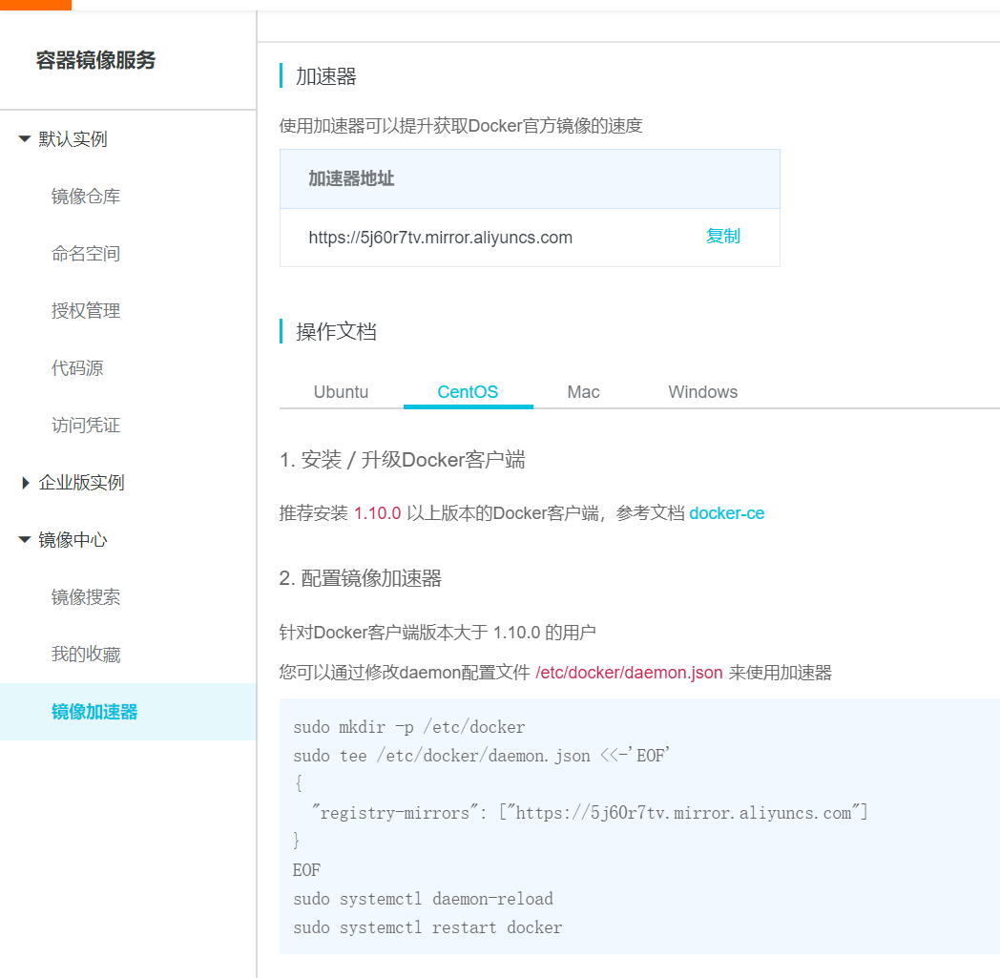
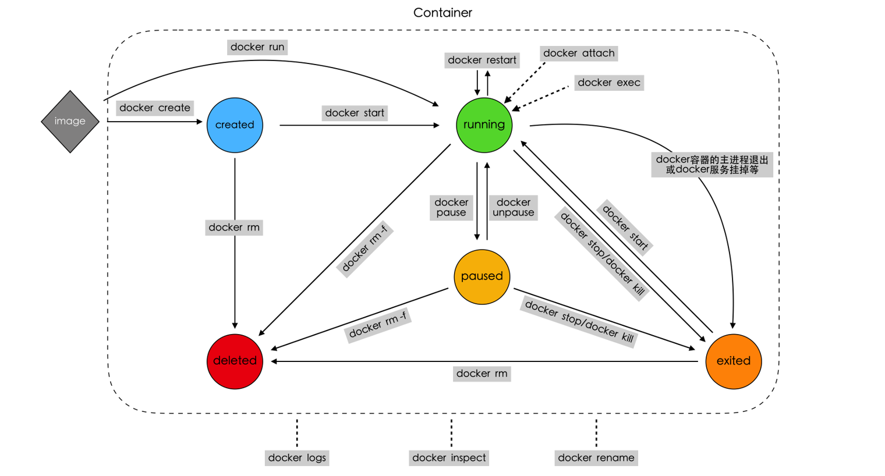
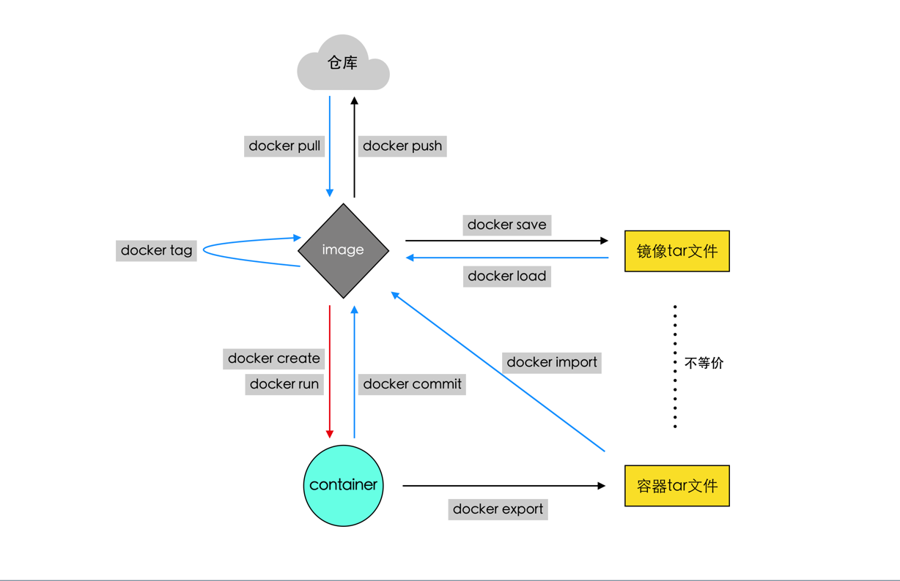

# docker

## docker安装

centos下安装文档https://docs.docker.com/engine/install/centos/

官方源下载太慢了，替换阿里源

```
sudo yum-config-manager --add-repo  https://mirrors.aliyun.com/docker-ce/linux/centos/docker-ce.repo
```

镜像加速



## 常用命令

### 镜像相关

1. docker pull   拉取镜像
2. docker rmi   删除镜像
3. docker save  备份镜像
4. docker load  备份还原
5. docker tag  重命名
6. docker image inspect  镜像信息
7. docker history  镜像分层信息

### 容器相关

1. docker create  创建容器
2. docker start  启动容器
3. docker run  创建并启动
4. docker pause 暂停
5. docker unpause  取消暂停
6. docker stop  关闭容器
7. docker kill  强制立刻关闭
8. docker restart  重启动
9. docker container rm  删除容器
10. docker container inspect  容器详细信息
11. docker logs  容器日志信息
12. docker rename  容器重命名
13. docker attach  容器连接
14. docker exec  容器中执行新命令
15. docker export  容器导出

### 镜像与容器相关

1. docker commit  容器生成镜像
2. docker import  容器打包的导入为镜像


## 容器生命周期



## 容器与镜像关系

