### 学习目标

- [x] 了解tcp协议
- [x] websocket


- [x] http协议理解
- [x] 了解http2
- [x] socket编程


## TCP协议

### 7层网络模型

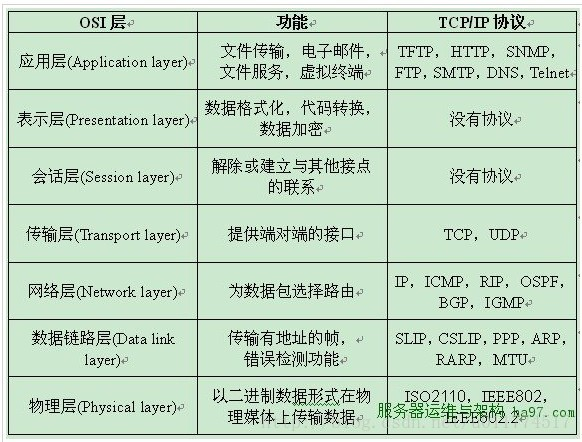

### TCP 协议特点

- 在 IP 协议之上，解决网络通讯可依赖问题
- 点对点（不能广播、多播），面向连接
- 双向传递（全双工）
- 字节流：打包成报文段、保证有序接收、重复报文自动丢弃
- 缺点：不维护应用报文的边界（对比 HTTP、GRPC）
- 优点：不强制要求应用必须离散的创建数据块，不限制数据块大小
- 流量缓冲：解决速度不匹配问题
- 可靠的传输服务（保证可达，丢包时通过重发进而增加时延实现可靠性）
- 拥塞控制

### tcp三次握手

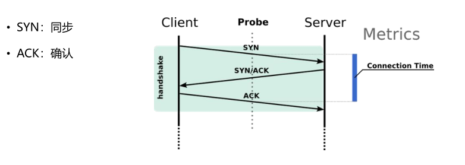

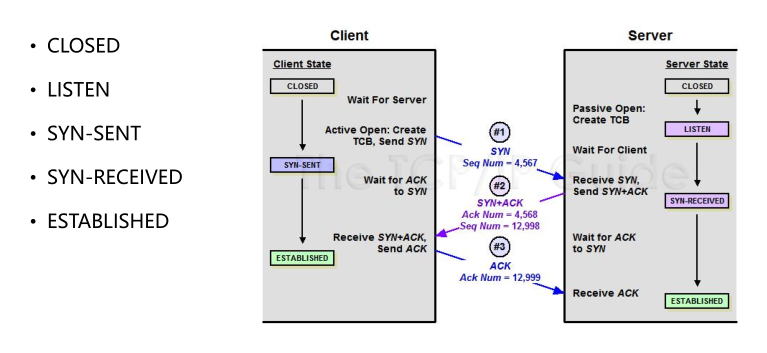

目的：

明确自己和对方的收发能力

- 同步 Sequence 序列号
	- 初始序列号 ISN（Initial Sequence Number）
- 交换 TCP 通讯参数
	- 如 MSS、窗口比例因子、选择性确认、指定校验和算法

### tcp流与报文

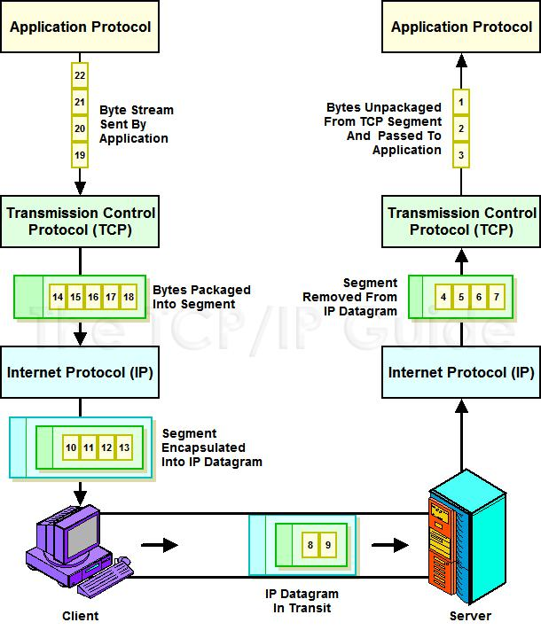

流分段的依据
- MSS：防止 IP 层分段
- 流控：接收端的能力

### MSS

 MSS 分类
- 发送方最大报文段 SMSS：SENDER MAXIMUM SEGMENT SIZE
- 接收方最大报文段 RMSS：RECEIVER MAXIMUM SEGMENT SIZE


## websocket

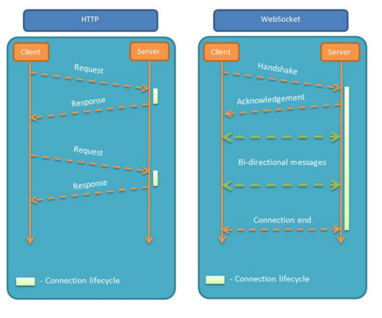

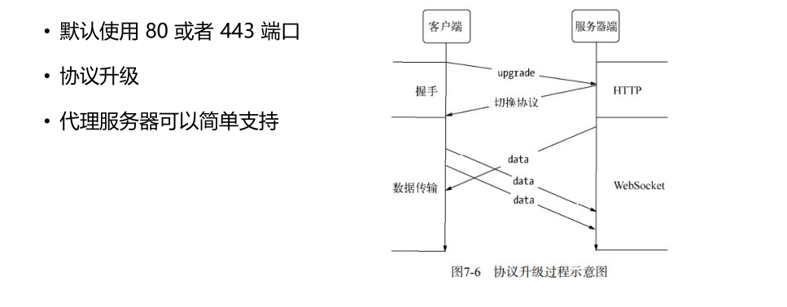

服务器可以主动向客户端推送信息，客户端也可以主动向服务器发送信息

### 长连接的心跳保持

- HTTP 长连接只能基于简单的超时（常见为 65 秒）
- WebSocket 连接基于 ping/pong 心跳机制维持

### 设计哲学：在 Web 约束下暴露 TCP 给上层

- 元数据去哪了？
- 对比：HTTP 协议头部会存放元数据
- 由 WebSocket 上传输的应用层存放元数据
- 基于帧：不是基于流（HTTP、TCP）
- 每一帧要么承载字符数据，要么承载二进制数据
- 基于浏览器的同源策略模型（非浏览器无效）
- 可以使用 Access-Control-Allow-Origin 等头部
- 基于 URI、子协议支持同主机同端口上的多个服务


## socket编程

socket 主要api

1. socket()
2. bind()
3. listen()
4. accept()
5. connect()
6. connect_ex()
7. send()
8. recv()
9. close()


### 简单c/s通信

```python
# server

import socket

HOST = '127.0.0.1'
PORT = 3456

with socket.socket(socket.AF_INET, socket.SOCK_STREAM) as s:
    s.bind((HOST, PORT))
    s.listen(10)
    conn, addr = s.accept()
    with conn:
        print('Connected by', addr)
        while True:
            data = conn.recv(1024)
            if not data:
                break
            conn.sendall(data)
```

```python
# client

import socket

HOST = '127.0.0.1'  
PORT = 3456       

with socket.socket(socket.AF_INET, socket.SOCK_STREAM) as s:
    s.connect((HOST, PORT))
    s.sendall(b'Hello, world')
    data = s.recv(1024)

print('Received', repr(data))
```


### 多用户服务端

#### 线程版

```python
import socket
import threading

HOST = '127.0.0.1'
PORT = 3456


def handler_conn(conn, addr):
    print('connected by ', addr)
    with conn:
        while True:
            data = conn.recv(1024)
            if not data:
                break
            conn.sendall(data)


with socket.socket(socket.AF_INET, socket.SOCK_STREAM) as s:
    s.bind((HOST, PORT))
    s.listen(10)
    while True:
        conn, addr = s.accept()
        # 开个新的线程去处理连接
        thread = threading.Thread(target=handler_conn, args=(conn, addr))
        thread.start()
```


### select版

```python
import socket
import selectors
import types

sel = selectors.DefaultSelector()


def accept_wrapper(sock):
    conn, addr = sock.accept()  # Should be ready to read
    print("accepted connection from", addr)
    conn.setblocking(False)
    data = types.SimpleNamespace(addr=addr, inb=b"", outb=b"")
    events = selectors.EVENT_READ | selectors.EVENT_WRITE
    sel.register(conn, events, data=data)


def service_connection(key, mask):
    sock = key.fileobj
    data = key.data
    if mask & selectors.EVENT_READ:
        recv_data = sock.recv(1024)  # Should be ready to read
        if recv_data:
            data.outb += recv_data
        else:
            print("closing connection to", data.addr)
            sel.unregister(sock)
            sock.close()
    if mask & selectors.EVENT_WRITE:
        if data.outb:
            print("echoing", repr(data.outb), "to", data.addr)
            sent = sock.send(data.outb)  # Should be ready to write
            data.outb = data.outb[sent:]


host, port = '127.0.0.1', 3456
lsock = socket.socket(socket.AF_INET, socket.SOCK_STREAM)
lsock.bind((host, port))
lsock.listen(10)
print("listening on", (host, port))
lsock.setblocking(False)
sel.register(lsock, selectors.EVENT_READ, data=None)

try:
    while True:
        events = sel.select(timeout=None)
        for key, mask in events:
            if key.data is None:
                accept_wrapper(key.fileobj)
            else:
                service_connection(key, mask)
except KeyboardInterrupt:
    print("caught keyboard interrupt, exiting")
finally:
    sel.close()
```


### asyncio版

```python
import asyncio

async def handle_echo(reader, writer):
    data = await reader.read(100)
    message = data.decode()
    addr = writer.get_extra_info('peername')

    print(f"Received {message!r} from {addr!r}")

    print(f"Send: {message!r}")
    writer.write(data)
    await writer.drain()

    print("Close the connection")
    writer.close()

async def main():
    server = await asyncio.start_server(
        handle_echo, '127.0.0.1', 3456)

    addr = server.sockets[0].getsockname()
    print(f'Serving on {addr}')

    async with server:
        await server.serve_forever()

asyncio.run(main())
```


## http协议

### 定义

一种无状态的、应用层的、以请求/应答方式运行的协议，它使用可扩展的语义和自描述消息格式，与基于网络的超文本信息系统灵活的互动

### 协议内容

#### 请求（Request）

客户端发送一个HTTP请求到服务端的格式：

- 请求行
- 请求头
- 请求体

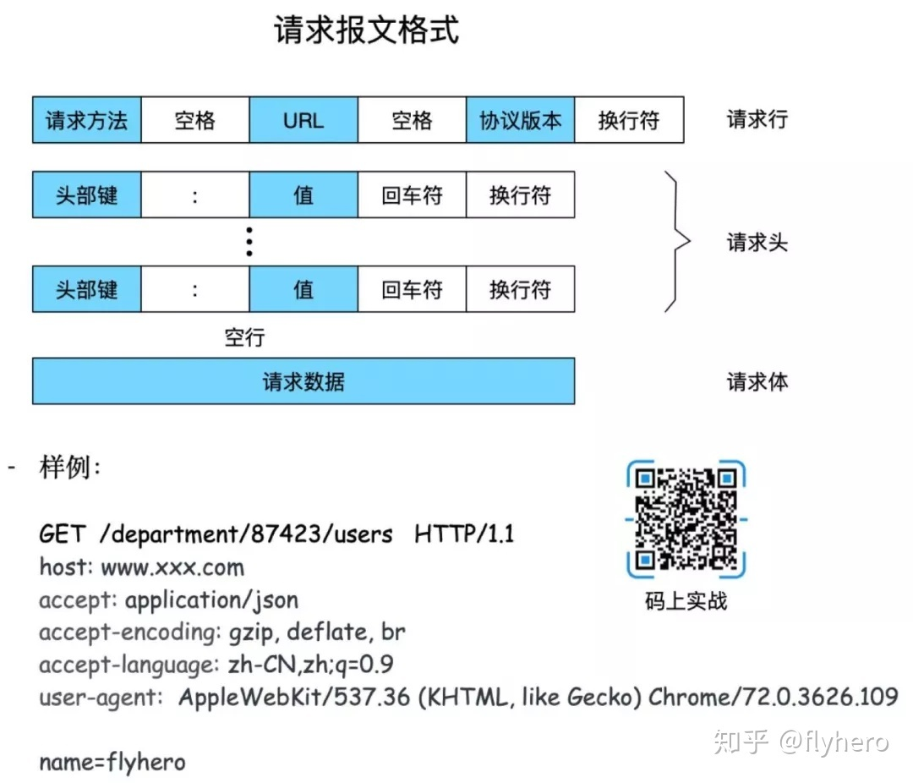

####   响应（Response）

服务端响应客户端格式：

- 状态行
- 响应头
- 响应体

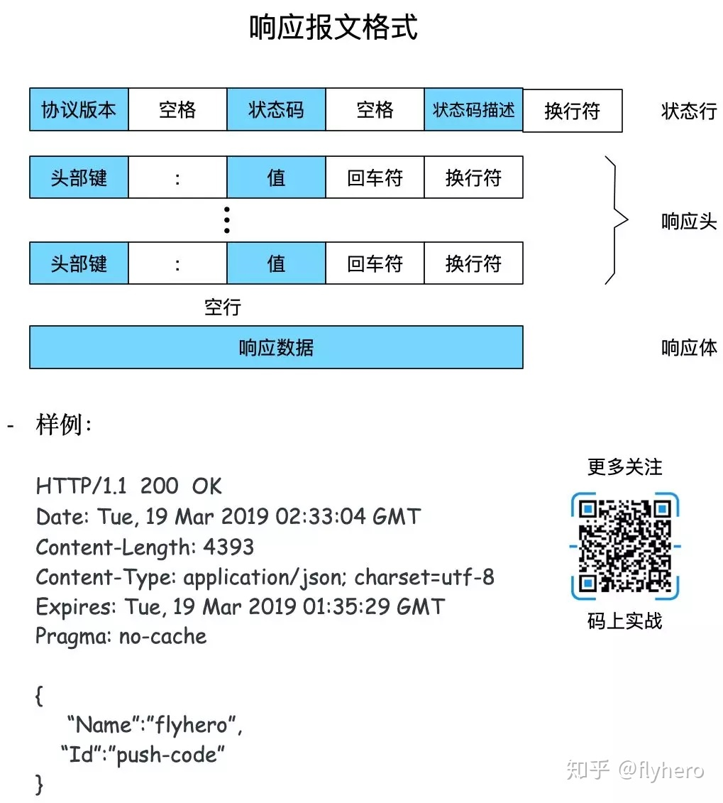

#### 状态码

HTTP状态码由三个十进制数字组成，第一个十进制数字定义了状态码的类型，后两个数字没有分类的作用。HTTP状态码共分为5种类型：

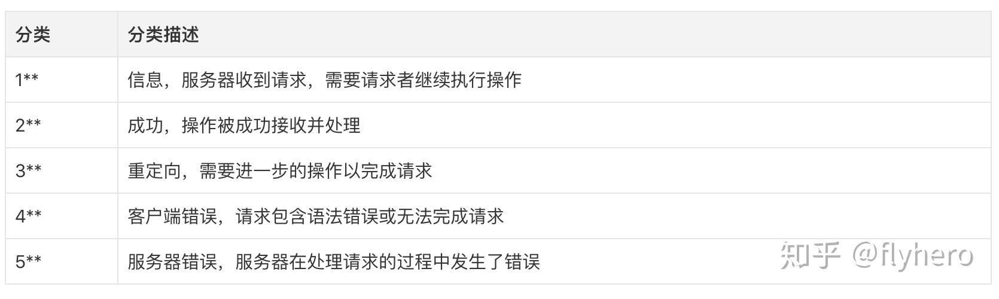

#### 请求方法（1.1）

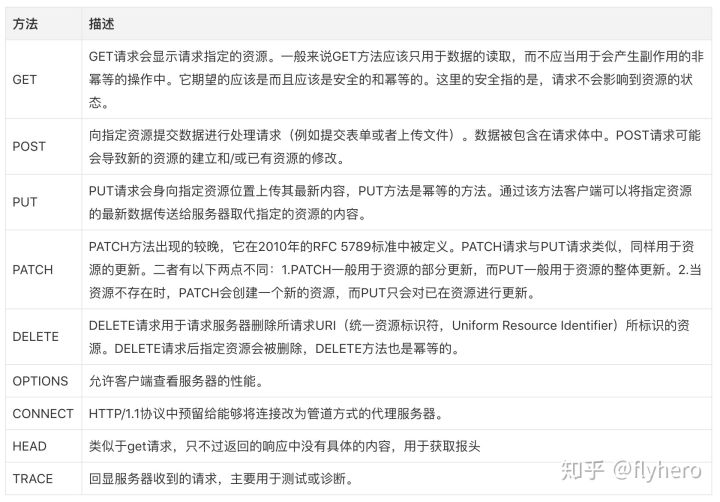

#### 请求和响应常见通用头

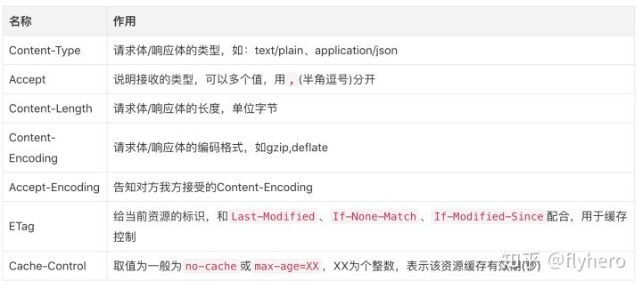

### 浏览器发起http请求流程

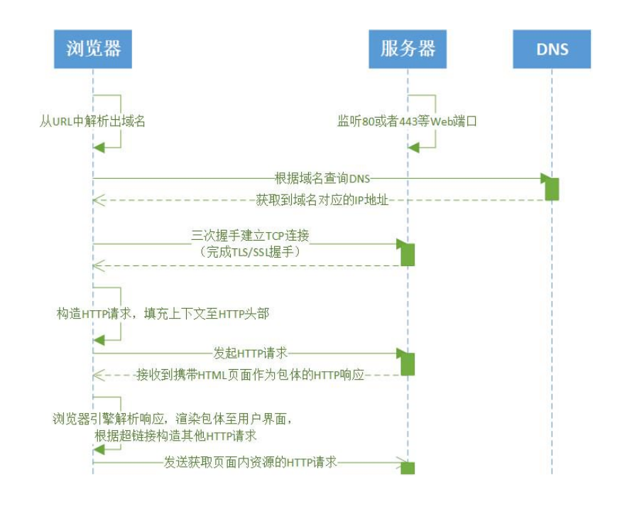

### 短连接与长连接

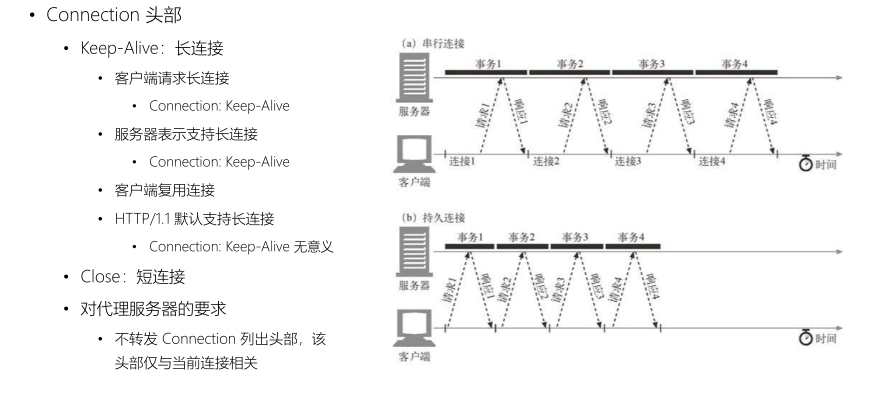

### 包体传输方式

发送 HTTP 消息时已能够确定包体的全部长度：

 	使用 Content-Length 头部明确指明包体长度

​	优点：接收端处理更简单

发送 HTTP 消息时不能确定包体的全部长度

​	 使用 Transfer-Encoding 头部指明使用 Chunk 传输方式

 	含 Transfer-Encoding 头部后 Content-Length 头部应被忽略

  	优点：

​		 基于长连接持续推送动态内容

 		压缩体积较大的包体时，不必完全压缩完（计算出头部）再发送，可以边发送边压缩

 		传递必须在包体传输完才能计算出的 Trailer 头部

### 多线程、断点续传、随机点播等场景的步骤

HTTP Range

允许服务器基于客户端的请求只发送响应包体的一部分给到客户端，而客户端
自动将多个片断的包体组合成完整的体积更大的包体
- 支持断点续传
- 支持多线程下载
- 支持视频播放器实时拖动
- 服务器通过 Accept-Range 头部表示是否支持 Range 请求
- Accept-Ranges = acceptable-ranges
- 例如：
- Accept-Ranges: bytes：支持
- Accept-Ranges: none：不支持


## http2

-  传输数据量的大幅减少
	- 以二进制方式传输
	- 标头压缩
-  多路复用及相关功能
	- 消息优先级
-  服务器消息推送
	- 并行推送


在 HTTP/2 中，有了二进制分帧之后，HTTP /2 不再依赖 TCP 链接去实现多流并行了，在 HTTP/2中：

- 同域名下所有通信都在单个连接上完成。
- 单个连接可以承载任意数量的双向数据流。
- 数据流以消息的形式发送，而消息又由一个或多个帧组成，多个帧之间可以乱序发送，因为根据帧首部的流标识可以重新组装。


