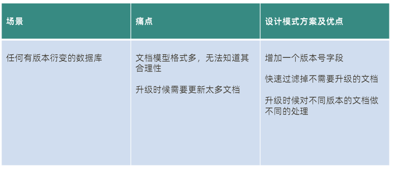

### 目标

- [x] 常用命令练习下
- [x] 理解索引机制和合理索引
- [x] 掌握文档模型设计规范
- [x] 理解复制集作用和实现原理
- [x] 理解分片集群作用和实现原理
- [x] 理解事务
- [x] 知道性能诊断
- [ ] 知道常见故障处理


### 特点

1. 建模为可选
2. json数据模型
3. 横向扩展 支持大量数据和并发

### 基本概念

详细操作命令    https://docs.mongodb.com/manual/reference/method/

#### 数据库

2. 相当于mysql数据库

##### 相关命令

1. 创建数据库，不存在即创建 

   ```sql
   use test
   ```

2. 查看当前数据库

   ```sql
   db
   ```

3. 删除数据库

   ```sql
   db.dropDatabase()
   ```


#### 集合

1. 集合就是一组文档的组合，就相当于是mysql中的表

##### 相关命令

1. 创建集合

   ```sql
   > use mydb
   switched to db mydb
   > db.createCollection("users")
   ```

2. 查看创建的集合

   ```shell
   show collections
   ```

3. 删除集合

   ```sql
   db.users.drop()
   ```


#### 文档

1. 文档是一组键值对(BSON)，类似于mysql中的一条记录
2. 文档中键值对是有序的
3. 区分大小写
4. 不能有重复的键

##### 主键

1. 文档的主键具有唯一性

2. 支持除数组外所有数据类型

3. 复合主键

4. 不指定主键默认生成

5. 默认主键长度12字节，包含创建时间精确到秒

   

#### 元数据

数据库的信息存储在集合中，他们统一使用系统的命名空间：DBNAME.system.*。

DBNAME 可用 db 或数据库名替代：

1. DBNAME.system.namespaces ：列出所有名字空间
2. DBNAME.system.indexs ：列出所有索引
3. DBNAME.system.profile ：列出数据库概要信息
4. DBNAME.system.users ：列出访问数据库的用户
5. DBNAME.system.sources ：列出服务器信息

### 文档的curd

#### 增(https://docs.mongodb.com/manual/tutorial/insert-documents/)

```sql
db.collection.insertOne(
   <document>,
   {
      writeConcern: <document>
   }
)
```

```sql
db.collection.insertMany(
   [ <document 1> , <document 2>, ... ],
   {
      writeConcern: <document>,
      ordered: <boolean>
   }
)
```

writeConcern：抛出异常级别

https://docs.mongodb.com/manual/reference/write-concern/

#### 删(https://docs.mongodb.com/manual/tutorial/remove-documents/)

```sql
db.inventory.deleteMany({})	
db.inventory.deleteMany({ status : "A" })
db.inventory.deleteOne( { status: "D" } )
db.inventory.deleteOne( { qty:{$lt:50}} )
```

#### 改(https://docs.mongodb.com/manual/tutorial/update-documents/)

```sql
db.collection.updateOne(
   <filter>,
   <update>,
   {
     upsert: <boolean>,
     writeConcern: <document>,
     collation: <document>,
     arrayFilters: [ <filterdocument1>, ... ],
     hint:  <document|string>        // Available starting in MongoDB 4.2.1
   }
)
```

updateOne/updateMany 方法要求更新条件部分必须具有以下之一，否则将报错：
 $set/$unset
 $push/$pushAll/$pop
 $pull/$pullAll
 $addToSet

使用 update 更新数组
 $push: 增加一个对象到数组底部
 $pushAll: 增加多个对象到数组底部
 $pop: 从数组底部删除一个对象
 $pull: 如果匹配指定的值，从数组中删除相应的对象
 $pullAll: 如果匹配任意的值，从数据中删除相应的对象
 $addToSet: 如果不存在则增加一个值到数组

#### 查(https://docs.mongodb.com/manual/tutorial/query-documents/)

```sql
db.inventory.find( {} )
db.inventory.find( { status: "D" } )
db.inventory.find( { status: { $in: [ "A", "D" ] } } )
db.inventory.find( { status: "A", qty: { $lt: 30 } } )
db.inventory.find( { $or: [ { status: "A" }, { qty: { $lt: 30 } } ] } )
db.inventory.find( {
     status: "A",
     $or: [ { qty: { $lt: 30 } }, { item: /^p/ } ]
} )
```

查询逻辑运算符
 $lt: 存在并小于
 $lte: 存在并小于等于
 $gt: 存在并大于
 $gte: 存在并大于等于
 $ne: 不存在或存在但不等于
 $in: 存在并在指定数组中
 $nin: 不存在或不在指定数组中
 $or: 匹配两个或多个条件中的一个
 $and: 匹配全部条件

投影：指定返回字段或不返回字段 ，不能同时指定除id外 


### 聚和管道(https://docs.mongodb.com/manual/aggregation/)

整个聚合运算过程称为管道（Pipeline），它是由多个步骤（Stage）组成。
• 接受一系列文档（原始数据）；
• 每个步骤对这些文档进行一系列运算；
• 结果文档输出给下一个步骤；


从效果而言，聚合框架相当于 SQL 查询中的：

1. GROUP BY
2. LEFT OUTER  JOIN
3. AS等

基本格式

```sql
pipeline = [$stage1, $stage2, ...$stageN];
db.<COLLECTION>.aggregate(
pipeline,
{ options }
);
```

常见步骤


常见运算符


### 索引机制

#### 覆盖查询

如果所有需要的字段都在索引中，不需要额外的字段，就可以不再需要从数据页加载数据，这就是查询覆盖。

#### 索引扫描/集合扫描


#### 查询形状

就是查询字段


#### Selectivity——过滤性

在一个有10000条记录的集合中：
• 满足 gender= F 的记录有4000 条
• 满足 city=LA 的记录有 100 条
• 满足 ln=‘parker’ 的记录有 10 条
条件 ln 能过滤掉最多的数据，city 其次，gender 最弱。所以 ln 的过
滤性（selectivity）大于 city 大于 gender。
应该使用过滤性大的字段建立索引

#### Index Prefix——索引前缀

db.human.createIndex({firstName: 1, lastName: 1, gender: 1, age: 1})
以上索引的全部前缀包括：
• {firstName: 1}
• {firstName: 1, lastName: 1}
• {firstName: 1, lastName: 1, gender: 1}
所有索引前缀都可以被该索引覆盖，没有必要针对这些查询建立额外的索引

#### 索引原理

 B-树


#### 索引执行计划


#### 查询分析

explain()

#### 组合索引


#### 组合索引字段顺序的影响


#### 全文索引


#### 部分索引


#### 数据库端-执行请求（读）


不能命中索引的搜索和内存排序是导致性能问题的最主要原因

#### 数据库端-执行请求（写）


磁盘速度必须比写入速度要快才能保持缓存水位

#### 问题诊断工具

mongostat

mongotop

mongod 日志

mtools

### 数据模型


#### 文档模型的设计原则：性能和易用

#### 什么时候该使用引用方式？

1. 内嵌文档太大，数 MB 或者超过 16MB
2. 内嵌文档或数组元素会频繁修改
3. 内嵌数组元素会持续增长并且没有封顶

#### 基础建模小结

1. 90:10 规则： 大部分时候你会使用内嵌来表示 1-1，1-N，N-N
2. 内嵌类似于预先聚合（关联）
3. 内嵌后对读操作通常有优势（减少关联）

#### 根据读写工况细化

1. 最频繁的数据查询模式
2. 最常用的查询参数
3.  最频繁的数据写入模式
4.  读写操作的比例
5.  数据量的大小

基于内嵌的文档模型
根据业务需求，
使用引用来避免性能瓶颈
使用冗余来优化访问性能

##### MongoDB 引用设计的限制

1. MongoDB 对使用引用的集合之间并无主外键检查
2. MongoDB 使用聚合框架的 $lookup 来模仿关联查询
3. $lookup 只支持 left outer join
4. $lookup 的关联目标（from）不能是分片表

#### MongoDB 设计模式


##### 分桶


##### 列行转换


#####  版本字段



##### 近似计算


##### 预预聚


##### 文档模式设计小结


### 事务

#### 写操作事务

##### 什么是 writeConcern ？

writeConcern 决定一个写操作落到多少个节点上才算成功。writeConcern 的取值包括：
• 0：发起写操作，不关心是否成功；
• 1~集群最大数据节点数：写操作需要被复制到指定节点数才算成功；
• majority：写操作需要被复制到大多数节点上才算成功。
发起写操作的程序将阻塞到写操作到达指定的节点数为止

writeConcern 可以决定写操作到达多少个节点才算成功，journal 则定义如何才算成
功。取值包括：
• true: 写操作落到 journal 文件中才算成功；
• false: 写操作到达内存即算作成功。

#### 读操作事务

##### 什么是 readPreference？

readPreference 决定使用哪一个节点来满足
正在发起的读请求。可选值包括：
• primary: 只选择主节点；
• primaryPreferred：优先选择主节点，如
果不可用则选择从节点；
• secondary：只选择从节点；
• secondaryPreferred：优先选择从节点，
如果从节点不可用则选择主节点；
• nearest：选择最近的节点；

##### 什么是 readConcern？

在 readPreference 选择了指定的节点后，readConcern 决定这个节点上的数据哪些
是可读的，类似于关系数据库的隔离级别。可选值包括：
• available：读取所有可用的数据;
• local：读取所有可用且属于当前分片的数据;
• majority：读取在大多数节点上提交完成的数据;
• linearizable：可线性化读取文档;
• snapshot：读取最近快照中的数据;

##### readConcern: 如何实现安全的读写分离


##### readConcern: 小结

• available：读取所有可用的数据
• local：读取所有可用且属于当前分片的数据，默认设置
• majority：数据读一致性的充分保证，可能你最需要关注的
• linearizable：增强处理 majority 情况下主节点失联时候的例外情况
• snapshot：最高隔离级别，接近于 Seriazable

#### MongoDB ACID 多文档事务支持


##### 事务的隔离级别

● 事务完成前，事务外的操作对该事务所做的修改不可访问
● 如果事务内使用 {readConcern: “snapshot”}，则可以达到可重复读
Repeatable Read

##### 事务写机制

MongoDB 的事务错误处理机制不同于关系数据库：
● 如果两个事务开始先后修改同一个文档，则后一个事务修改这个
文档时会触发 Abort 错误，因为此时的修改冲突了；
● 这种情况下，只需要简单地重做事务就可以了；
● 如果一个事务已经开始修改一个文档，在事务以外尝试修改同一个文档，则事务以
外的修改会等待事务完成才能继续进行（write-wait.md实验）。


### 复制集

MongoDB 复制集的主要意义在于实现服务高可用

它的现实依赖于两个方面的功能：
• 数据写入时将数据迅速复制到另的独立节点上
• 在接受写入的节点发生故障时自动选举出一个新的替代节点

在实现高可用的同时，复制集实现了其他几个附加作用：
• 数据分发：将数据从一个区域复制到另一个区域，减少另一个区域的读延迟
• 读写分离：不同类型的压力分别在不同的节点上执行
• 异地容灾：在数据中心故障时候快速切换到异地


### 分片集群

#### 为什么要使用分片集群？

• 数据容量日益增大，访问性能日渐降低，怎么破？
• 新品上线异常火爆，如何支撑更多的并发用户？
• 单库已有 10TB 数据，恢复需要1-2天，如何加速？
• 地理分布数据

分片集群可以有效解决性能瓶颈及系统扩容问题


#### 路由节点 mongos

提供集群单一入口
转发应用端请求
选择合适数据节点进行读写
合并多个数据节点的返回
无状态

建议至少2个

#### 配置节点

配置（目录）节点
提供集群元数据存储
分片数据分布的映射


#### 数据节点

以复制集为单位横向扩展
最大1024分片
分片之间数据不重复
所有分片在一起才可
完整工作

#### MongoDB 分片集群特点

• 应用全透明，无特殊处理
• 数据自动均衡
• 动态扩容，无须下线
• 提供三种分片方式

#### 分片集群数据分布方式

• 基于范围
• 基于 Hash
• 基于 zone / tag


#### 正确的姿势 - 选择合适片键

• 影响片键效率的主要因素：
• 取值基数（Cardinality）；
• 取值分布；
• 分散写，集中读；
• 被尽可能多的业务场景用到；
• 避免单调递增或递减的片键；

####  选择基数大的片键

• 对于小基数的片键：
• 因为备选值有限，那么块的总数量就有限；
• 随着数据增多，块的大小会越来越大；
• 水平扩展时移动块会非常困难；

#### 选择分布均匀的片键

• 对于分布不均匀的片键：
• 造成某些块的数据量急剧增大
• 这些块压力随之增大
• 数据均衡以 chunk 为单位，所以系统无能为力

### 状态监控


### 常见故障


